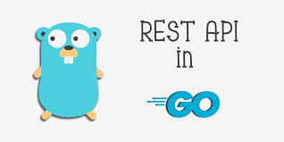

<p align="center">
  
</p>

<h1 align="center">
Restful Go
</h1>

Create a restful api with Golang for a simple Book website. The main idea behind this project was to gain some knowledge about implementing a **rest-api in Golang** and working with **gorm** and MySQL database.

## What do you learn in this project?
- Use gorilla/mux package to create an http service
- Rest-api implementation in Golang
- MySQL database in Golang
- Golang gorm

## Project structure
All of the application codes are in _internal_ directory. In _internal_ there is a _cmd_ where I start my http server. 
There are _database_ and _models_ packages for database connection and our service models. And finally in _http/router_ I implemented the application logic and endpoints.

## Run project
Clone the project and use the following command to set up the server: (make sure to have a MySQL database running)
```shell
go run internal/cmd/main.go
```

Result should be something like this:
```shell
2022/08/22 11:09:18 Database connected on 127.0.0.1:3306 ...
2022/08/22 11:09:19 Server started ...
```

## Endpoints
Here is a documentation for the service APIs:
- **/api/books**
  - returns the list of the books
  - method = GET

- **/api/books/{id}**
  - returns information of a single book
  - method = GET

- **/api/books**
  - creates a new book and returns the created book
  - method = POST

- **/api/books/{id}**
  - updates a book by its id 
  - method = PUT

- **/api/books/{id}**
  - deletes a book  
  - method = DELETE
